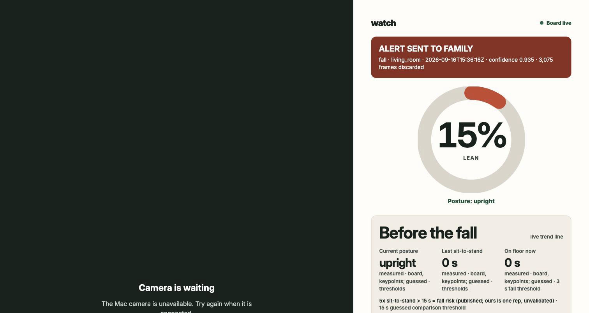

# ElderSteady Private

California will not let a facility put a camera in her room; at home the same question is yours — this is a fall alert that answers it in bytes.



### Run it in 3 commands

```sh
POSE=1 bash perception/live_demo.sh
python3 -m http.server 7311 --bind 127.0.0.1
open http://127.0.0.1:7311/interface/demo.html
```

## PRODUCT THINKING — The numbers before the fall are the product

**Problem:** An adult child wants to know their aging parent is all right, without watching them — and every camera product makes them watch, or asks them to trust a company they cannot check.

**Crux:** A fall product only speaks after the fall, and cries wolf before it. ElderSteady adds posture, sit-to-stand, floor time, rhythm, and company before the fall. These are implemented; posture values were measured in one controlled one-person test; rules are guessed.

**What we refused:** no confidence percentage on the family screen because it manufactures certainty; no automatic `911` because family keeps context; no face ID because identity is not the job; no recording or cloud inference because frames staying in the room is the claim; no diagnosis, wandering/stove classification, Model Compiler, or Vercel because none was required to test it.

### The sell test has 3 conditions met and 2 partly met

| Sapp condition | State | Test |
|---|---|---|
| Love the product | met | It proves in bytes that no video left. |
| Trust the seller | met | A judge can compare `cat /sys/class/net/end0/statistics/tx_bytes` with the screen. |
| They can get the result | partly met | “I'm okay” can stand down an alert and the daughter gets one grade-3 banner; no family has used it. |
| Clear game plan | partly met | Day `1` baseline and day `30` first trend are designed; the `30`-day view is fixture, not a run. |
| True urgency | met in the argument; not buyer-tested | The cost is the long lie after a fall nobody saw. |

### The graveyard records why each direction stopped

- The Unplug (`6.0`) — the demo camera rides the cable it would pull.
- Facility buyer (`7.0`) — CDSS PIN `15-RM-01` requires a Licensing waiver for a resident-room camera; a waiver-gated sale was not this build. It remains the pitch's last line.
- Headroom meter, “rooms per board” (`7.0`) — an extrapolation could not be measured before `11:30`.
- Two witnesses (`8.6`) — it was an output of the counter, not a peer; folded in.
- Phone on the hotspot (`8.9`) — useful, not the crux; built in `15 min`.
- Calibration by one bend (`8.3`) — one rep can put the threshold above a partial fall; parked with a floor.
- On-board VLM — Qwen3-VL-4B via LLiMa streamed H.264 in the reference app; kept as roadmap.
- Watch, Vigil, Frameless, Unseen, Provably — wristwatch, death vigil, or cold; the founder chose ElderSteady Private.

Kept: pixels-in/bytes-out (`9.6`, the only idea to clear the gate), the reframe, nearest-person selection, the coverage gate, and post-fall voice. Full record: [product findings log](docs/product-findings-log.md).

## HOW THE BUILD WAS MADE — Contracts and reviews bounded six agents

The parallax structure had an architect, a setup lane, Codex build lanes, `3` Claude Code lanes, and `1` GPT-6 research lane. By mid-morning on day `2`, `6` agents were working from contracts and fixture evals written before code. Builder–Validator reviews kept implementation and grading separate; the fixture evidence layer scored `6/6`, and `perception/test_ledger.py` had `10+` checks.

The crucible froze MASTER and V1→V4 across `3` rounds. Ideas were scored, cut, or parked; pixels-in/bytes-out alone cleared the gate at `9.6`. The shakiest assumption—2D pose separating standing, sitting, and floor—was attacked in `4` controlled on-camera tests. Tests `1–3` missed chair or floor; test `4` passed stand, chair, sit-to-stand, floor, and fall for `1` person. It is not validation.

Senso was shared memory: `1` “AI Infra Hackathon” folder held `20` documents by `10:50` on day `2`; CURRENT.md was at rev `4`, PROCESS at rev `5`, and a cold start was about `3.5k` tokens (`~2.5k` for CURRENT.md). Research ran in `3` rounds of `15–25 min`; node IDs carried measured / computed / fixture / guessed labels between lanes. See [how we used Senso](docs/how-we-used-senso.md).

## THE BOX — The application runs board-local on the MLA

- SiMa Modalix DevKit; eLxr `12` (aria) Edge Edition; kernel `6.18.3-modalix` `aarch64` — measured on the box.
- `pyneat 0.4.0` on Python `3.11.2` — measured on the box.
- YOLO26-m pose INT8 b1 and YOLO26-m detection INT8 b1 from the Palette Neat model zoo; no Model Compiler — implemented.
- Application and models are board-local on NVMe: `29 GB`, `22 GB` free — measured.
- It ran with the NFS `/workspace` unmounted at `2026-09-15 17:50`; the board-local command exited `0` — measured.
- MLA inference is `8.1–8.3 ms/frame` — measured; it is not camera-to-alert latency, total compute, or power.

## HOW IT IS CONNECTED — Video enters once; numbers return

Mac (`192.168.1.10`, `en8`) ↔ DevKit (`192.168.1.20`) is direct Ethernet. UART `/dev/cu.usbserial-*` is recovery; after a re-plug run `sudo nmcli connection up end0-static`. The Mac camera goes through ffmpeg as UDP MPEG-TS on `:5004`; board OpenCV decodes it. Board stdout returns over SSH to `interface/live/board.log`, which the pages poll. The phone uses the Mac hotspot.

```text
Mac camera
  -> ffmpeg -> UDP MPEG-TS :5004 -> direct Ethernet
  -> Modalix DevKit
       OpenCV decode
       -> YOLO26-m INT8 pose/detection -> pyneat -> MLA
       -> fall-event JSON
       -> ledger line (pixel_bytes, end0 rx/tx)
       -> trend line (posture, floor, sit-to-stand, company)
  -> SSH stdout -> interface/live/board.log -> family/demo pages -> hotspot phone
  -> rhythm.py -> per-minute day.json -> demo_clock rhythm/wander event
  -> voice.py -> offline post-fall Vosk listener -> heard phrases only
```

The demo camera is the Mac; in the product, the box would own the camera.

## TOOLS — The same versions reproduce the path

- Host: macOS `26.5.1`; Chrome rendered every UI change, and inspection found `3` defects, including a page saying “Waiting for the board” while `1,515` frames flowed.
- Colima `0.10.3`, not Docker Desktop: the Palette SDK requires a Linux container and Colima supplies that runtime without adding Docker Desktop. Its host-address setup can put `192.168.1.10/24` on VM loopback; change it to `/32` so board SSH reaches `192.168.1.20`.
- Palette Neat SDK container `ghcr.io/sima-neat/sdk:v2.1.3.0`; `sima-cli 2.1.17`; ffmpeg `8.0.1`.
- Codex CLI `0.147.0`; Claude Code; Senso CLI.
- About `$4` of the `$200` Codex budget was spent — guessed.
- Vosk `0.15` small English model, offline; it listens for `60 s`, prints heard phrases, and records nothing. It runs on the laptop; MLA audio is roadmap.

## THE RESULT — Measured, guessed, fixture, and roadmap stay separate

**Silver Bundle, SiMa track, AI Infra Summit Hackathon (announced 18 Sep 2026): $1,600 — Modalix DevKit + webcam.** Details in [docs/WIN-2026-09-18.md](docs/WIN-2026-09-18.md).

### Measured today

- Real on-camera falls: bend/lean at `2026-09-16T15:03:01Z` (`63%`, streak `58` frames, confidence `0.916`, `157` discarded), floor at `2026-09-16T17:12:49Z` (confidence `0.916`, `611` discarded), a second fall at `2026-09-16T15:06:29Z` (confidence `0.935`, `100` discarded), and a quiet-mode lean fall at `2026-09-16T15:24:58Z` (confidence `0.935`, `2183` discarded). Evidence: [`evidence/captures/`](evidence/captures/).
- Quiet ledger at frame `150`: `3.36 MB` video in, `11.1 KB` out (`11 KB` rounded), `1 : 303` on `end0` — measured bytes; ratio computed. Full run: `13,350` frames, `124.0 MB` in, `1.26 MB` out, `1 : 98` — measured bytes; ratio computed. The long run is worse because posture-change diagnostics crossed `end0` through SSH while the classifier flapped; today's honest long-run number is about `1 : 100`, not `1 : 300` — explanation.
- Before quiet mode: `3450` frames, `34 MB` in, `739 KB` out, `1 : 46` — measured bytes; ratio computed. `PRINT_EVERY=5` removed diagnostics, not events — explanation interpretation. Decoded bytes are frames × `1280` × `720` × `3` — computed.
- Test `4` ended at upright `53.8 s`, sitting `6.4 s`, floor `1.9 s`, `sts_n 1`, company `89.8 s` — measured values; guessed rules. Sit-to-stand, floor, company, and rhythm are live. Nearest largest box is the subject, other people are company, and near-equal boxes are `unclear` — implemented, measured live.
- Voice listens after a fall — implemented on laptop; not on board. The application-boundary counter measured frames pulled and destroyed; it does not instrument silicon or prove payload contents.

### Guessed or not checked

- Fall trigger: `55%` lean for `8` frames — guessed. Sitting: hips below `0.65`; floor: hips and shoulders below `0.85` for at least `2 s`; company: at least `2` people — guessed, measured on `1` person. The published `5×` sit-to-stand over `15 s` is an anchor; this measures `1` unvalidated rep.
- Rhythm uses per-minute `day.json`; night is `23:00–06:00`, an event follows `3` consecutive night minutes, with `30 min` cooldown — guessed rules; clock-shifted demo events carry `"demo_clock": true`.
- One room, one camera at `2 m`; no older adult, family, held-out home, sensitivity, false-alarm rate, relay across town, end-to-end latency, or clinical prediction was tested.

### Fixture

- The `30`-day view in `interface/trend.html` is fixture, landing, and not board evidence. The evidence grader's `6/6` is fixture.

### Roadmap

- Camera on the box; audio on the MLA; VLM; calibration as an install step; facility waiver, consent, access, and shutoff procedures; cross-town relay.

## RUN AND DEVELOP — The operator path is short

Use the `3` commands above for the live demo. The board-local launcher is `/home/sima/watch-perception/run_board_local.sh`; do not use `dk` for the disconnected proof. Validate captured JSONL with `python3 perception/validate_events.py < capture.jsonl`. Over UART, compare `/sys/class/net/end0/statistics/tx_bytes` before and after a run.

```text
contracts/          event contracts and fixtures
perception/         board app, launcher, validator, runbook
evidence/captures/  measured camera and ledger logs
evidence/            rhythm and offline voice paths
interface/          family, demo, and fixture trend pages
docs/               product findings and Senso record
pitch/              argument, scripts, and eval
```
